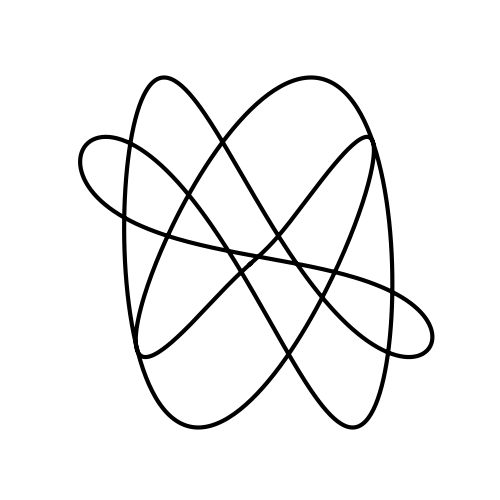
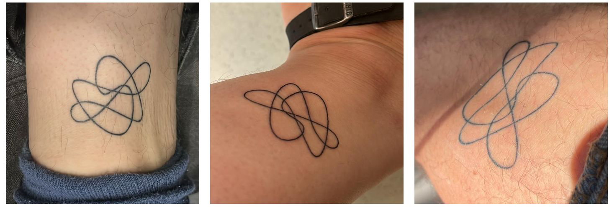

# Lissattoo
This repo provides a small script that creates tattoo motives inspired by (Lissajous curves)[https://de.wikipedia.org/wiki/Lissajous-Figur].
A Lissajous curve is a two-dimensional curve, which can be written as 
$$
x_1(t) = A_1 \sin(\omega_1 \cdot t + \phi_1)
x_2(t) = A_2 \sin(\omega_2 \cdot t + \phi_2),
$$
or, alternatively, as the sum of two perpendicular sinusoidal curves. To "generalize" this
idea, we can consider curves which can be expressed as the sum of an arbitrary number $N$ of 
sinusoidal curves with amplitudes $(A_i)_{1\leq i \leq N}$, angular velocities $(\omega_i)_{1\leq i \leq N}$,
and phase shifts $(\phi_i)_{1\leq i \leq N}$, which are rotated by $(\theta_i)_{1\leq i \leq N}$ w.r.t to some axis, e.g. the y-axis
$$
(x_1(t), x_2(t))^T = \sum_{i=1}^N R(\theta_i) \cdot (A_i \sin(\omega_i \cdot t + \phi_i), 0)^T,
$$
where $R(\theta)$ is the matrix performing 2D rotation by the angle $\theta$.  
The `lissattoo.py` script generates such curves as tattoo motives based on user-defined
parameters $(A_i, \omega_i, \phi_i, \theta_i)_{1 \leq i \leq N}$ and some $i \in \mathbb{N}$.
This way, you can create much more irregularly shaped "Lissajous curves" than the "traditional" ones, 
which are - in my opinion - really cool motives for one-line tattoos. Another plus is that
you can encode all sorts of meaning in the set of parameters you choose, such as your siblings' birthday 
or your cat's name! :)

## Usage
To generate your Lissajous-ish curve just replace the parameters by your favorite numbers that you 
want to encode in your tattoo in the following command and run it then. 

```
python lissattoo.py --theta 2.09439510239 0 4.18879020479 --a 4 7 2 --omega 4 3 6 --phi 1996 1990 2000 --output ./lissattoo.png
```

An image of the curve will be saved in the path specified in the output parameter.

## Examples
The command above creates a curve made of three sinusoidal components at an angle of 120° to each other.
The amplitude, frequency and phase parameters can be interpreted as birthdates (April 4th, 1996; March 7th, 1990; June 2nd, 2000) of three persons. And this is how the resulting curve looks:



My sister, my brother and I picked up the idea of encoding our birthdays in a Lissattoo,
this is what it looks like



